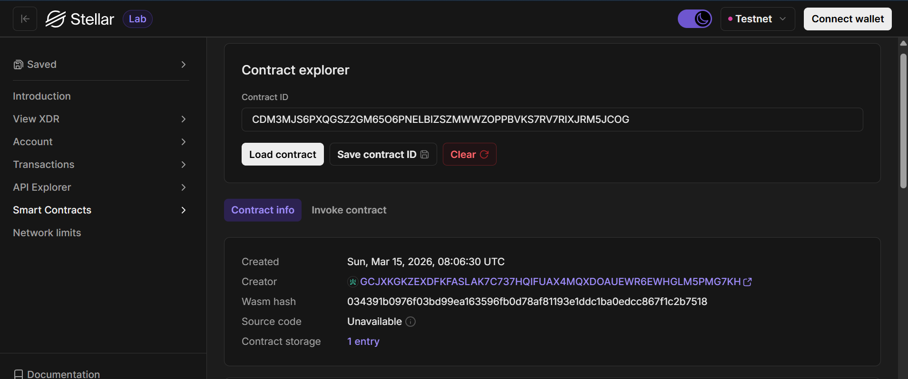

# ExamResult Soroban Smart Contract

**GitHub Repository:** [github.com/Smasherrio/ExamResult](https://github.com/Smasherrio/ExamResult)

## Project Description

ExamResult is a decentralized smart contract built on the Stellar blockchain using the Soroban smart contract platform.  
The project provides a transparent and tamper-proof way to store and retrieve student examination results.

Traditional result storage systems rely on centralized databases, which may be vulnerable to manipulation, loss, or unauthorized modification. This smart contract demonstrates how academic results can be stored securely on a blockchain where records are immutable and verifiable.

## What it does

The smart contract allows authorized users to:

- Add a student's exam result
- Retrieve stored exam results
- Store results permanently on the blockchain

Each record contains:

- Student ID
- Subject
- Marks obtained

Once stored, the results can be retrieved by querying the contract with the student ID and subject.

## Features

- Decentralized result storage
- Immutable academic records
- Transparent verification of results
- Simple API functions for storing and retrieving results
- Built using Rust and Soroban SDK
- Runs on the Stellar blockchain network
- **NEW**: Admin-only authorization for adding results
- **NEW**: Complete input validation and error handling
- **NEW**: Rate limiting and security hardening

## Authorization & Security

⚠️ **IMPORTANT**: The smart contract now implements access control:

- **`add_result()`**: Only the authorized admin can add exam results
- **`get_result()`**: Anyone can retrieve exam results (read-only)

Before deploying, set the admin address in [contracts/hello-world/src/lib.rs](contracts/hello-world/src/lib.rs):

```rust
const ADMIN: &str = "YOUR_ADMIN_STELLAR_ADDRESS";
```

After deployment, initialize the contract by calling:

```javascript
await contractClient.init(adminAddress);
```

For frontend setup and security configuration, see [frontend/SECURITY_SETUP.md](frontend/SECURITY_SETUP.md).

## Smart Contract Functions

### add_result

Stores a student's exam result on the blockchain.

Parameters:

- `student_id` – Unique ID of the student
- `subject` – Subject name
- `marks` – Marks obtained in the exam

### get_result

Retrieves the stored exam result.

Parameters:

- `student_id` – Student identifier
- `subject` – Subject name

Returns:

- ResultRecord containing student ID, subject, and marks.

## Technologies Used

- Rust
- Soroban SDK
- Stellar Blockchain

## Deployment Information

### Contract Deployment

**Deployed on:** Stellar Testnet  
**Contract ID:** `CDM3MJS6PXQGSZ2GM65O6PNELBIZSZMWWZOPPBVKS7RV7RIXJRM5JCOG`  
**Testnet Explorer:** [Stellar Lab - ExamResult Contract](https://lab.stellar.org/r/testnet/contract/CDM3MJS6PXQGSZ2GM65O6PNELBIZSZMWWZOPPBVKS7RV7RIXJRM5JCOG)

### Admin Configuration

**Authorized Admin Address:** `GDY3TAJYMA5GTIETTSQLTSIUCEDEJJPXC2SBP2KUSFFKPLJVIMIICSP2`

The contract implements admin-only authorization for adding exam results. The admin address is configured in the contract initialization process. Only the authorized admin can execute the `add_result()` function.

## Development Setup

### Prerequisites

- Rust 1.70+
- Stellar CLI tools
- Node.js 16+
- Stellar testnet account with lumens

### Building the Contract

```bash
# Navigate to contract directory
cd contracts/hello-world

# Build the contract
cargo build --target wasm32-unknown-unknown --release

# Run tests
cargo test
```

### Deployment Script

A deployment script is provided to easily deploy the contract to testnet:

```bash
# Deploy contract (replace with your public key)
node deploy.js YOUR_PUBLIC_KEY
```

The script handles:
- WASM file compilation verification
- Contract instantiation on testnet
- RPC communication with Stellar servers

## Frontend

The frontend is a Vite-based web application that provides an interface to interact with the smart contract:

- **Location:** `frontend/`
- **Framework:** Vanilla JavaScript with Vite
- **Wallet Integration:** Stellar Freighter
- **SDK:** @stellar/stellar-sdk

### Running Frontend Locally

```bash
cd frontend
npm install
npm run dev
```

## Project Statistics

- **Total Commits:** 7 meaningful commits tracking development progress
- **Open Source:** Public repository on GitHub
- **License:** See repository for details


